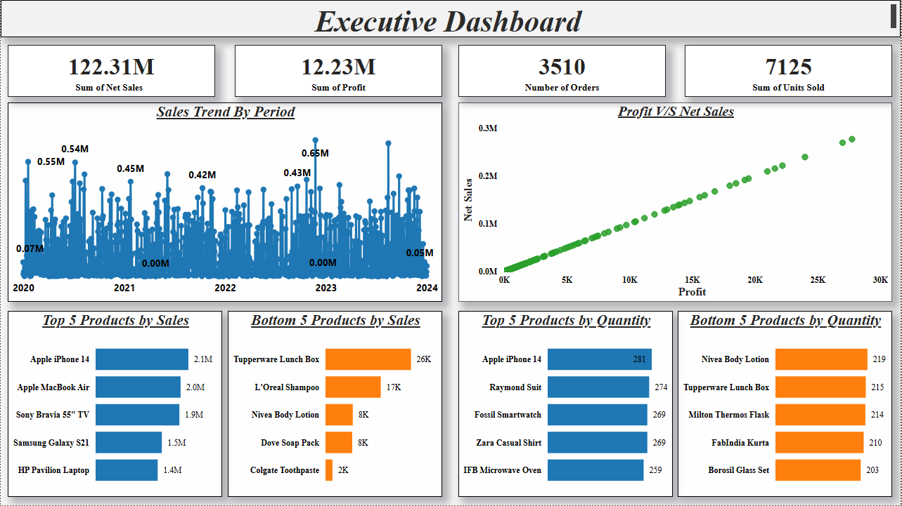
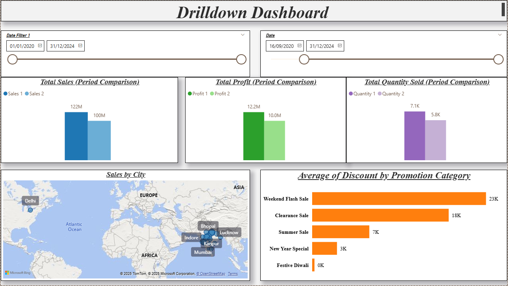
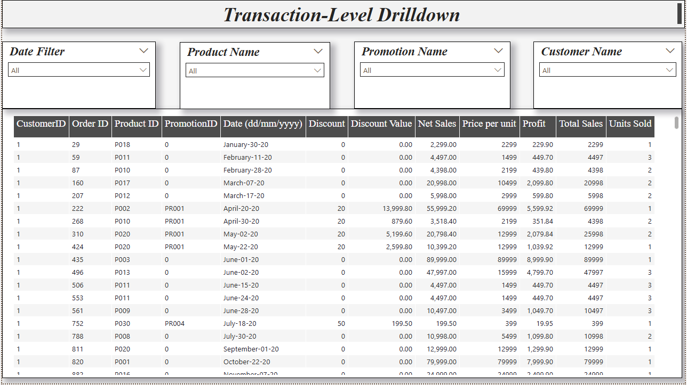

# 📊 Sales Analysis Dashboard (2020–2024)

## 🔹 Overview
This Power BI project analyzes **store sales data (2020–2024)** with over 3,500 transactions.  
The goal was to track sales performance, understand product profitability, analyze discounts, and uncover city-level insights.

---

## 🔹 Dataset
- **File:** `Store+Data.xlsx`
- **Fields:** Customer, Order ID, Product, Promotion, Date, Discount, Sales, Profit, Quantity
- **Period:** 2020 – 2024

---

## 🔹 Key KPIs
- 💰 **Total Sales:** $122M  
- 📈 **Total Profit:** $12.2M  
- 🛒 **Orders:** 3,510  
- 📦 **Quantity Sold:** 7,125  

---

## 🔹 Dashboards

### 1. Executive Dashboard
  
- Shows KPIs, sales trend, profit vs sales, and top/bottom products.  

### 2. Drilldown Dashboard
  
- Compare sales, profit, and quantity between two periods.  
- City-level analysis & discounts by promotion category.  

### 3. Transaction-Level Drilldown
  
- Interactive filters (Date, Product, Promotion, Customer).  
- Order-level detail table for deep exploration.  

---

## 🔹 Business Insights
- **Electronics dominate revenue** (iPhone 14 = $2.1M).  
- **FMCG products underperform** (Colgate only $2K).  
- **Delhi & Lucknow lead in city sales**.  
- **Weekend Flash Sales give highest discounts**.  

---

## 🔹 Tools Used
- Microsoft Power BI  
- Data Modeling (DAX, Relationships)  
- Excel for preprocessing  

---

## 🔹 Recommendations
- 📌 Focus marketing on **high-profit electronics**.  
- 📌 Reconsider stock/strategy for **low-performing FMCG products**.  
- 📌 Target promotions in **Delhi & Lucknow** where demand is strongest.  
- 📌 Optimize promotions → high discounts don’t always guarantee higher profit.  

---

## 🔹 Author
👤 **Divyaraj Jadeja**  
*Aspiring Data Analyst | Skilled in Power BI, SQL, Python, Excel*
